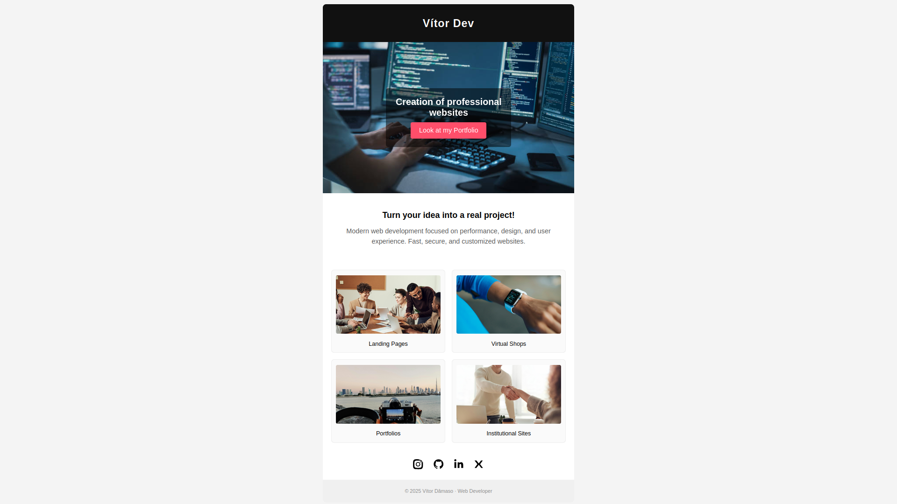

## ✉️ Email Template - Freelance Promotion

Este é um template de e-mail responsivo e moderno, criado para divulgação de meus serviços como desenvolvedor freelancer. O design foi inspirado em layouts minimalistas de e-commerce e landing pages, com foco em clareza visual, responsividade e conversão.

### 🚀 Funcionalidades

- Layout totalmente responsivo (desktop e mobile)
- Estrutura compatível com clientes de e-mail
- Seções organizadas: header, hero, serviços, redes sociais e footer
- Ícones em SVG integrados (Instagram, GitHub, LinkedIn, X, Behance)
- Imagens temáticas para cada tipo de serviço oferecido

📸 **Prévia do resultado:**

